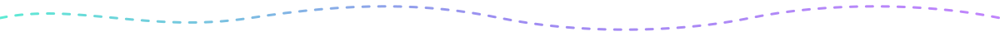
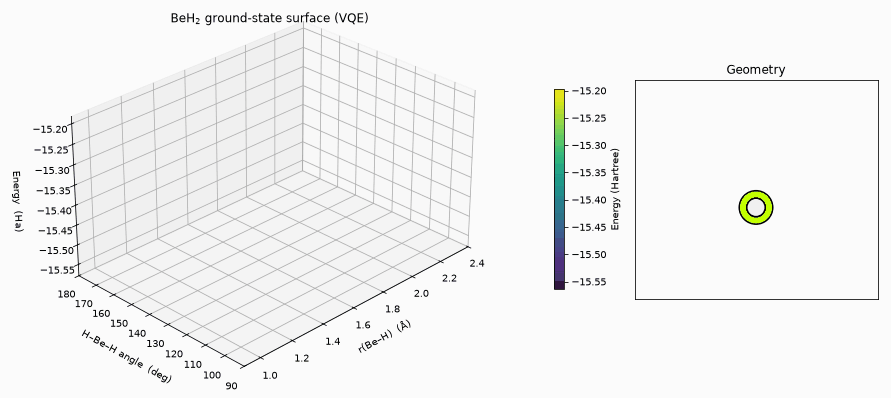

<div align="center">


</div>



<div align="center">

## ⚛️&nbsp; Group Members

<table>
  <tr>
    <td align="center" width="220">
      <b>Shahraz Hussain Siyam</b><br>
      <sub><code>2105023</code></sub>
    </td>
    <td align="center" width="220">
      <b>Nabiha Tahseen</b><br>
      <sub><code>2105031</code></sub>
    </td>
    <td align="center" width="220">
      <b>Debashri Roy</b><br>
      <sub><code>2105035</code></sub>
    </td>
  </tr>
  <tr>
    <td align="center" width="220">
      <b>Niloy Kumar Mondal</b><br>
      <sub><code>2105044</code></sub>
    </td>
    <td align="center" width="220">
      <b>Amit Saha</b><br>
      <sub><code>2105049</code></sub>
    </td>
    <td align="center" width="220"></td>
  </tr>
</table>

</div>


<div align="center">

## 🎬&nbsp; A Scan in Action



<sub>BeH₂ ground-state energy surface — 110 VQE energies rising out of a bond-length × bond-angle
grid in scan order while the molecule redraws to match, then one turn around the finished
surface. The trough runs along the angle axis: bending is soft, stretching is stiff.</sub>

</div>

Rebuilt from the saved scan. Reopen the scan yourself — no VQE re-run, it takes a few seconds:

```bash
python experiment/beh2/beh2_ground_state_estimation.py --load beh2_surface_scan.json
```


<div align="center">

## 🧪&nbsp; Experiments

</div>

Each folder under [`experiment/`](experiment/) is one molecule. A run sweeps a
geometry coordinate, solves for the ground-state energy at every point with
VQE, and plots the curve **live** next to a drawing of the molecule deforming.
When the sweep finishes the window stays open in **review mode** — the
`LEFT`/`RIGHT` arrow keys or the slider walk back and forth along the finished
curve, and the molecule redraws to match whichever point you land on.

| Folder | Script | What it varies |
|---|---|---|
| [`experiment/h2/`](experiment/h2/) | `h2_ground_state_estimation.py` | H–H bond length |
| [`experiment/h2o/`](experiment/h2o/) | `h2o_ground_state_estimation.py` | symmetric O–H stretch, **or** H–O–H bend |

```bash
source .venv/bin/activate

# H2 — bond length 0.3 → 2.5 Å in 0.1 Å steps
python experiment/h2/h2_ground_state_estimation.py --start 0.3 --stop 2.5 --step 0.1

# H2O — stretch both O–H bonds (angle fixed), or bend the angle (bonds fixed)
python experiment/h2o/h2o_ground_state_estimation.py --coordinate stretch
python experiment/h2o/h2o_ground_state_estimation.py --coordinate bend --start 70 --stop 160 --step 5
```

<div align="center">

### 💾&nbsp; Saving &amp; reloading a scan

</div>

VQE points are expensive — a fraction of a second each for H₂, but **2–4
minutes each** for H₂O in the larger active space, so a full stretch scan runs
~40 minutes. You should never pay that twice. **Every finished scan saves
itself automatically**, and `--load` reopens it *without re-running any VQE*.

**Saving** happens on its own when a scan completes. Two files land next to the
script:

| File | Purpose |
|---|---|
| `..._scan.json` | Energies **+ metadata** (coordinate, fixed values, active space, range). This is what `--load` reads. |
| `..._scan.csv` | The same energies as a flat table — for your report, a spreadsheet, or your own plots. Nothing reads this back; it's for you. |

```bash
# Runs the VQE, then saves h2_scan.json + h2_scan.csv automatically
python experiment/h2/h2_ground_state_estimation.py

# Save under a name of your choosing.
# A bare name lands next to the script -> experiment/h2/fine_scan.json + .csv
python experiment/h2/h2_ground_state_estimation.py --step 0.05 --save fine_scan

# A name with a directory part is treated as an ordinary path instead
python experiment/h2/h2_ground_state_estimation.py --save ~/results/run7

# Don't save at all
python experiment/h2/h2_ground_state_estimation.py --no-save
```

> [!NOTE]
> A **bare** `--save` name is placed beside the script, next to where the
> default save would go — so results stay with their molecule instead of
> scattering into whatever folder you launched from. Pass a path with a `/` in
> it when you want to choose the location yourself. Either way the script
> prints the full path it wrote.

**Loading** skips the chemistry entirely and jumps straight into the
interactive review window — arrow keys, slider and molecule all work exactly as
they did after a live run. It takes a few seconds instead of minutes or hours:

```bash
python experiment/h2/h2_ground_state_estimation.py   --load h2_scan.json
python experiment/h2o/h2o_ground_state_estimation.py --load h2o_bend_scan.json
python experiment/h2o/h2o_ground_state_estimation.py --load h2o_stretch_scan.json
```

> [!TIP]
> A bare filename is looked for where you are **and** next to the script, so
> `--load h2_scan.json` works from the project root or from inside
> `experiment/h2/`. If it can't find the file it tells you both places it
> looked. The scripts also print the exact `--load` line to copy when they
> finish saving, with paths relative to wherever you ran them.

The save/load format is shared by every molecule via
[`experiment/scan_io.py`](experiment/scan_io.py), so the two scripts can't drift
into writing files the other can't read. Each file records a `format_version`
and is refused outright if it doesn't match, rather than half-loading and
failing confusingly later.


<div align="center">
<sub><b>CSE 402</b> &#183; Numerical Analysis, Simulation and Modeling</sub>
</div>
